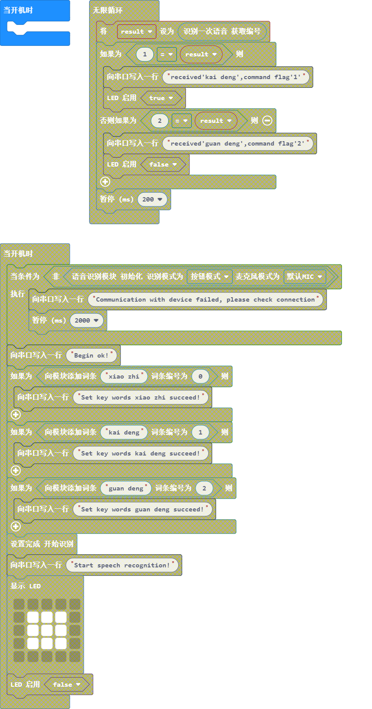

# pxt-dfrobot_asr

[这是一款离线语音识别模块](https://www.dfrobot.com.cn/goods-3011.html)

> 在 [https://qsjhyy.github.io/pxt-dfrobot_asr](https://github.com/DFRobot/pxt-dfrobot_asr) 打开此页面

## 用作扩展

此仓库可以作为 **插件** 添加到 MakeCode 中。

* 打开 [https://makecode.microbit.org/](https://makecode.microbit.org/)
* 点击 **新项目**
* 点击齿轮图标菜单下的 **扩展**
* 搜索 **https://github.com/qsjhyy/pxt-dfrobot_asr** 并导入

## 编辑此项目 

在 MakeCode 中编辑此仓库。

* 打开 [https://makecode.microbit.org/](https://makecode.microbit.org/)
* 点击 **导入**，然后点击 **导入 URL**
* 粘贴 **https://github.com/DFRobot/pxt-dfrobot_asr** 并点击导入

## Basic usage

```blocks

    /**
     * TODO: 语音识别模块 初始化
     * @param e1 识别模式
     * @param e2 麦克风模式
     * @return 初始化成功返回true 失败返回false
     */
    ASR.begin(enum1: ModeEnum, enum2: MicrophoneModeEnum)

    /**
     * TODO: 语音模块开始识别
     */
    ASR.start()

    /**
     * TODO: 向模块添加词条
     * @param words  代表词条的字符串
     * @param idNum  词条的识别号
     * @return bool值 成功返回 true, 失败返回 false
     */
    ASR.addCommand(words: string, idNum: number)

    /**
     * TODO: 读取识别到的词条
     * @return 返回代表词条的识别号
     */
    ASR.read()

    /**
     * TODO: 设置模块的i2c地址(掉电重启后生效)
     * @param addr  需要设置的i2c地址(0~127)
     */
    ASR.setI2CAddr(addr: number)

```

## Blocks preview

This image shows the blocks code from the last commit in master.
This image may take a few minutes to refresh.



## 元数据（用于搜索、渲染）

* for PXT/microbit
<script src="https://makecode.com/gh-pages-embed.js"></script><script>makeCodeRender("{{ site.makecode.home_url }}", "{{ site.github.owner_name }}/{{ site.github.repository_name }}");</script>

## License

MIT

Copyright (c) 2018, microbit/micropython Chinese community  


## Supported targets

* for PXT/microbit
(The metadata above is needed for package search.)
